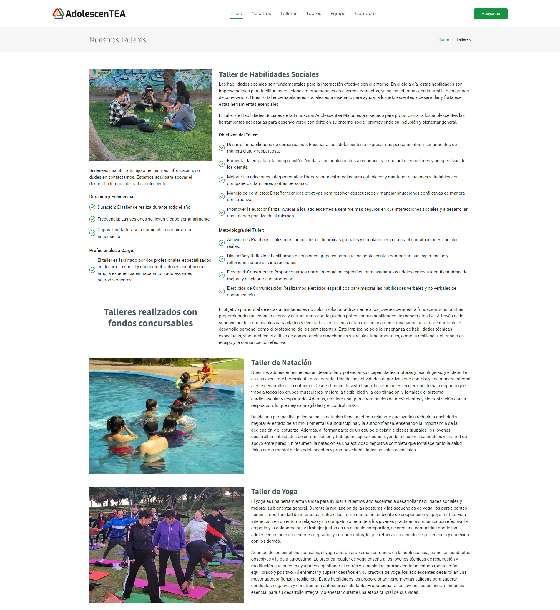
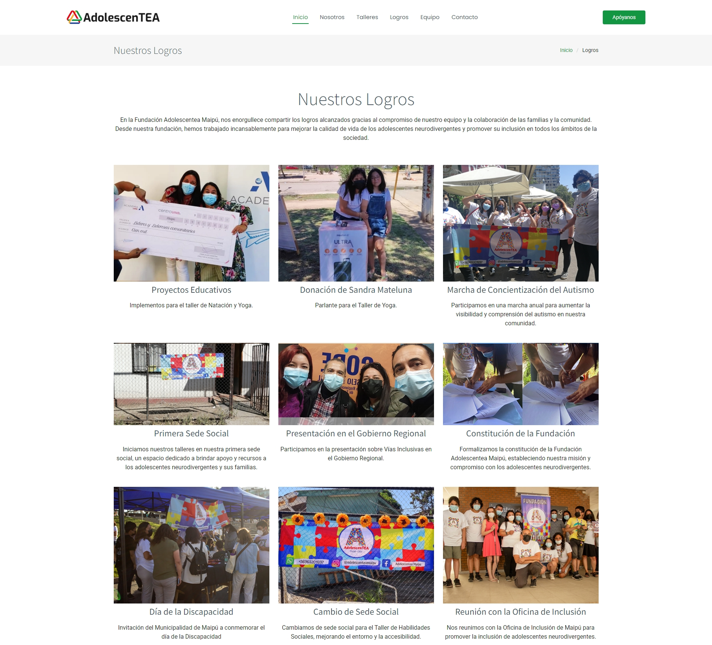

# Fundación Adolescentes Maipú

Este proyecto es una página web diseñada y desarrollada para la Fundación Adolescentes Maipú, utilizando una plantilla inicial de BootstrapMade y personalizándola para adaptarse a las necesidades específicas de la fundación.

## Descripción

La Fundación Adolescentea maipú se dedica a apoyar y empoderar a adolescentes en situación de vulnerabilidad a través de programas educativos, sociales y de salud.

## Tecnologías Utilizadas

- HTML5
- CSS3
- Bootstrap
- JavaScript 

## Características Principales

- **Diseño Responsivo:** La página está optimizada para verse bien en dispositivos móviles, tablets y computadoras de escritorio.
  
- **Secciones Personalizadas:** Las siguientes paginas fueron realizadas por mi 
    - profesionales.html, equipo.html, apoyanos.html, contacto.html, logros.html, preguntas-frecuentes.html.

Pagina de taller

Pagina de los Logros

## Capturas de Pantalla

Responsive

